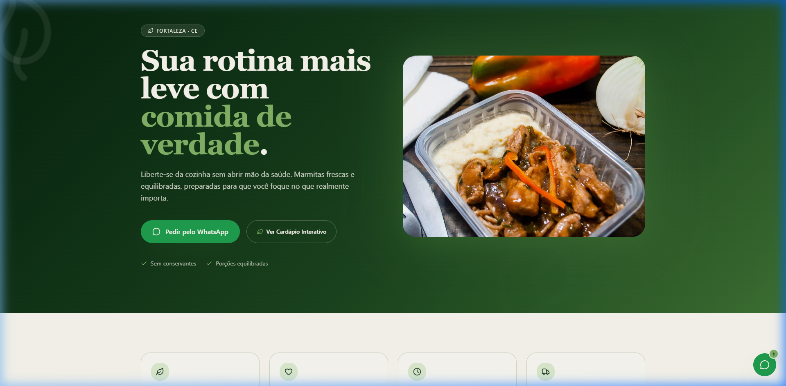
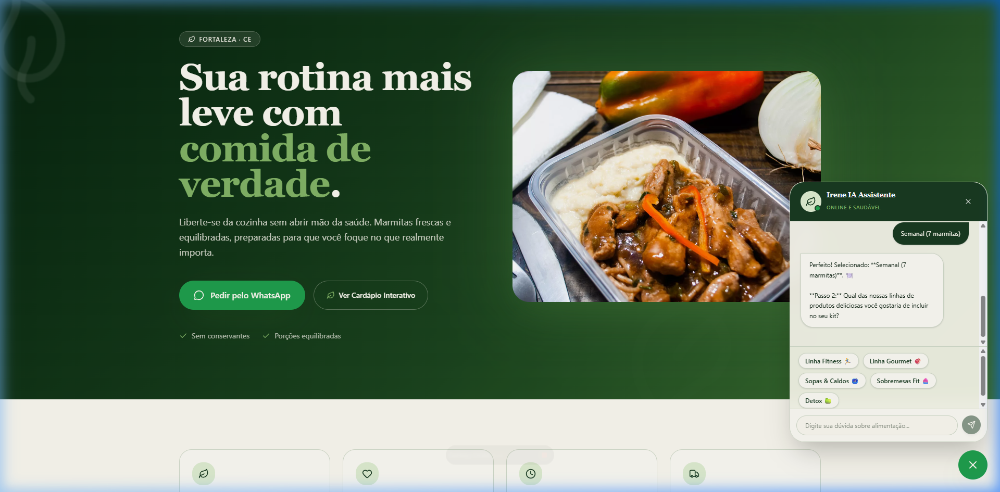
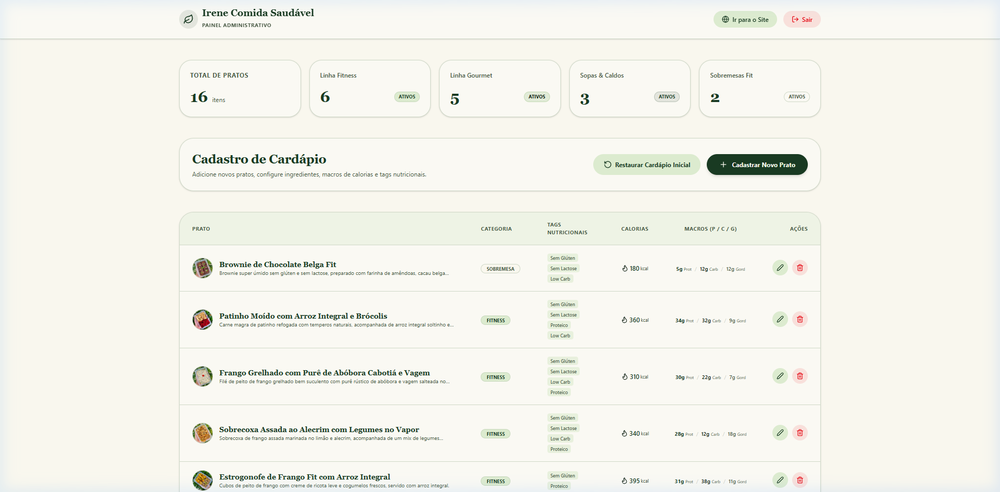
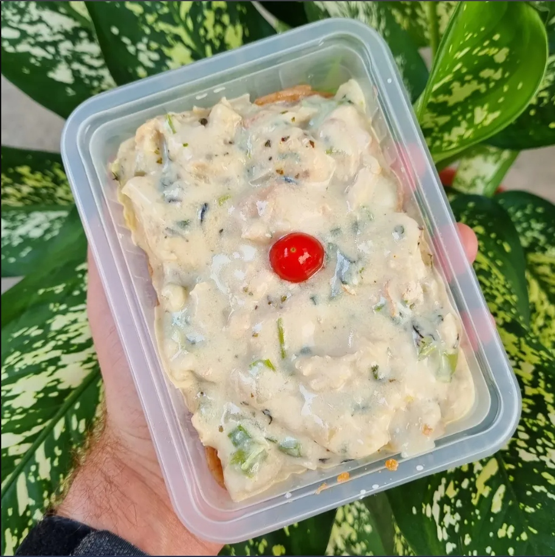

# Irene Comida Saudável 🌿🍽️

Uma plataforma web premium e de alta conversão para o serviço de marmitas saudáveis, fitness e gourmet em Fortaleza-CE. Desenvolvido com foco em estética minimalista sofisticada, carregamento ultra-rápido, copywriting de alto impacto e segurança estrita de dados.

---

## 📸 Demonstração Visual do Sistema Real

### 🏠 1. Landing Page & Hero Section
A vitrine virtual com paleta de cores verde floresta profunda (oklch), tipografia elegante e animação orgânica de folhas flutuantes.


### 💬 2. IA Assistente & Montador de Kits Rápido
Nosso robô conversacional guiando o cliente na montagem sequencial em 4 etapas rápidas e gerando o pedido pré-formatado para o WhatsApp da Irene.


### ⚙️ 3. Painel de Controle Administrativo (Dashboard)
A área administrativa segura onde a Irene gerencia seu cardápio ativo e desfruta do compressor off-screen de imagens em tempo real.


### 🍗 4. Otimização Inteligente de Fotos
Fotos reais de alta fidelidade e nitidez mantida, otimizadas do lado do cliente (compactadas de 5MB para ~50KB) para garantir carregamento instantâneo.


---

## ✨ Principais Funcionalidades

### 🧠 1. Assistente Virtual Híbrido com Montador de Kit (Fase 2)
Um widget flutuante premium no canto inferior direito que engaja os clientes em tempo real:
* **Montador de Kits Automatizado (Wizard 4 Passos)**:
  1. **Planos**: Iniciante (1 marmita), Semanal (7 marmitas), Quinzena (15 marmitas) ou Mensal (30 marmitas).
  2. **Linha**: Fitness, Gourmet, Sopas & Caldos, Sobremesas Fit ou Detox.
  3. **Porções**: 250g, 350g, 400g ou 550g.
  4. **Restrições**: Sem Glúten, Sem Lactose, Vegano, Low Carb ou Nenhuma.
* **Envio Direto ao WhatsApp**: Compila as escolhas do usuário em uma nota de pedido formatada e abre o WhatsApp da Irene em um único clique.
* **Inteligência Artificial (OpenRouter)**: Integrado ao modelo `openai/gpt-oss-120b:free` para tirar dúvidas nutricionais gerais.
* **Contexto de Estoque Ativo**: Injeta dinamicamente os pratos reais cadastrados no banco de dados (`localStorage`) no prompt do sistema do bot.
* **Resiliência Offline**: Se o limite da API externa for atingido, o chatbot assume uma máquina de estados interativa local para que o cliente nunca veja um erro.
* **Roteamento Inteligente**: Dúvidas médicas severas ou questões de frete são identificadas pelo bot, que sugere educadamente o atendimento pessoal com a Irene.
* **Scroll Imediato (0ms)**: Ao clicar em "Ver Cardápio", a página desliza de forma instantânea e sem lag até a vitrine de pratos.

### 📸 2. Compressor de Imagens Off-Screen Canvas (Fase 2)
Evita erros de carregamento e reduz custos de banda:
* **Client-Side Optimization**: Fotos pesadas de celulares modernos (5MB a 15MB) carregadas no painel de administração são redimensionadas em tempo real antes de serem enviadas.
* **Redimensionamento Proporcional**: Escala automática limitando a largura/altura máxima a 800px.
* **Compressão em Massa**: Conversão para JPEG com 75% de qualidade usando HTML5 Canvas.
* **Resultado**: Imagens convertidas em base64 extremamente leves de **50KB a 80KB**, garantindo que o cardápio dos clientes carregue instantaneamente mesmo sob redes móveis limitadas.

### 🎨 3. Design Premium & Experiência do Usuário (UX)
* **Estética Sofisticada**: Paleta de cores em tons de verde profundo (escala HSL/OKLCH) e tipografia elegante (`Fraunces` e `Inter`).
* **Animações Fluidas**: Sistema de folhas decorativas flutuantes (`animate-float`) que cria uma atmosfera orgânica e premium.
* **Responsividade Total**: Layout 100% fluido e adaptado para a experiência em celulares e tablets.

### 🚀 4. SEO & Presença no Google (Fase 2)
* **Nome de Site Otimizado (Google Site Name)**: Configuração de dados estruturados JSON-LD `WebSite` e tags OpenGraph `og:site_name` para garantir que o Google exiba **"Irene Comida Saudável"** nos resultados de pesquisa ao invés do domínio padrão da Vercel.
* **Hierarquia Semântica**: Estruturação correta de tags `<h1>`, `<h2>` e `<h3>` com foco em palavras-chave regionais de Fortaleza.

---

## 🔒 Segurança & Boas Práticas
* **Isolamento de Credenciais**: O arquivo `.gitignore` foi rigorosamente atualizado para ignorar arquivos de variáveis de ambiente (`.env`, `.env.local`, etc.).
* **Zero Segredos Hardcoded**: Todas as chaves e segredos da API do OpenRouter e Supabase foram isolados do repositório público e são consumidos estritamente das variáveis de ambiente (`import.meta.env`).

---

## 🛠️ Tecnologias Utilizadas
* **React 19** & **TypeScript**
* **TanStack Start** & **TanStack Router** (Roteamento moderno de alta performance)
* **Tailwind CSS v4** (Abordagem de estilo moderna e performática)
* **Lucide React** (Ícones limpos e profissionais)
* **Vite** (Ferramenta de build e desenvolvimento veloz)

---

## 🚀 Como Executar o Projeto

### 1. Pré-requisitos
Certifique-se de possuir o [Node.js](https://nodejs.org/) instalado em sua máquina.

### 2. Configurando o Ambiente
Crie um arquivo `.env` na raiz do projeto contendo as credenciais de desenvolvimento (não comente ou envie este arquivo ao GitHub):

```env
# Configurações do Assistente Virtual IA (OpenRouter)
VITE_OPENROUTER_API_KEY=sua_chave_privada_aqui
VITE_OPENROUTER_MODEL=openai/gpt-oss-120b:free

# Configurações do Banco de Dados / Supabase
VITE_SUPABASE_URL=https://sua-url-do-supabase.supabase.co
VITE_SUPABASE_ANON_KEY=sua_chave_anonima_do_supabase
```

### 3. Instalação e Execução
1. Instale as dependências:
   ```bash
   npm install
   ```
2. Execute em modo de desenvolvimento:
   ```bash
   npm run dev
   ```
3. Abra o navegador no endereço indicado (geralmente `http://localhost:5173`).

---

## 📈 Backlog & Gestão do Projeto
Para acompanhar as melhorias, tarefas técnicas e critérios de aceitação detalhados das issues criadas para esta fase, consulte o arquivo local:
👉 **[ISSUES.md](./ISSUES.md)**

---

Desenvolvido com foco em excelência estética, segurança e resultados de negócios. 

**Desenvolvedor Kayohan Costa**  
🔗 [LinkedIn](https://www.linkedin.com/in/kayohancostadev)
